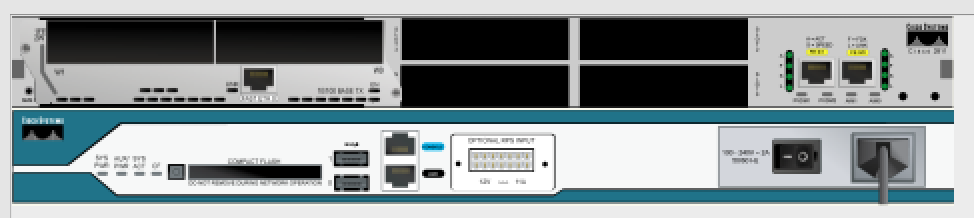
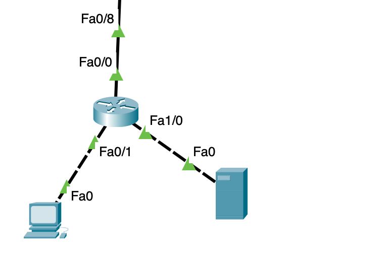
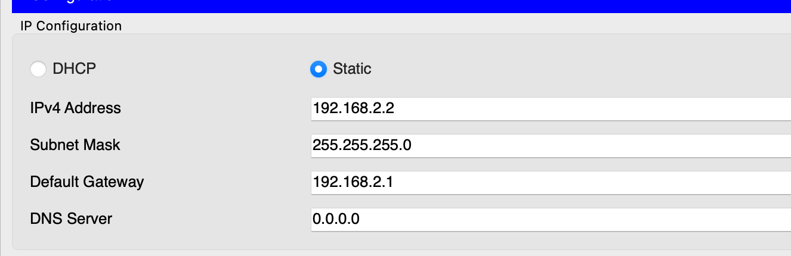
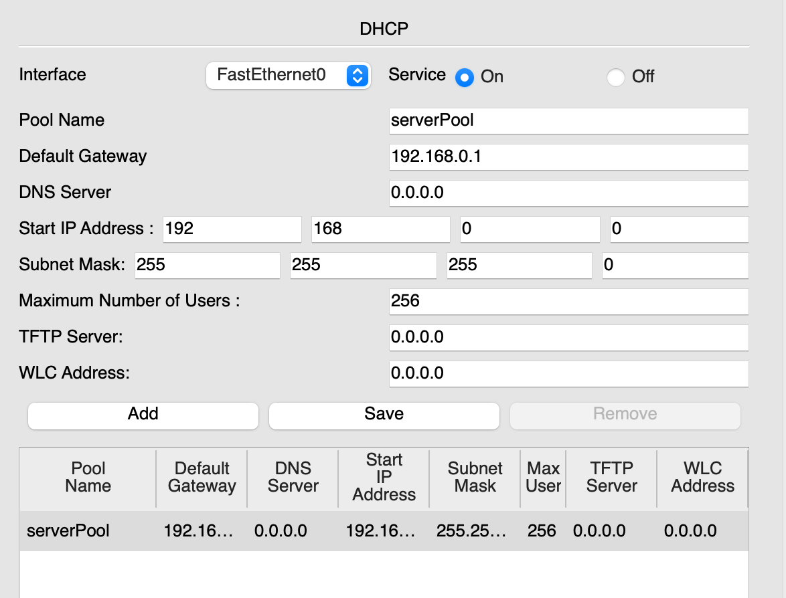
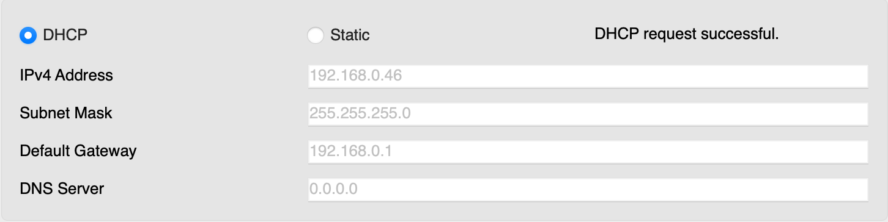

# DHCP-сервер

У нас стоит простая задача: настроить 100 компьютеров для работы. Каждому из них необходимо выдать уникальный (в пределах сети) IP-адрес. Однако вручную настраивать статические IP-адреса на каждом устройстве неудобно, поэтому мы воспользуемся DHCP-сервером, который автоматически раздаст IP-адреса всем устройствам в сети.

## Топология сети

На схеме ниже представлена сеть, состоящая из 100 компьютеров:


Все эти устройства находятся в верхней части сети.

## Настройка маршрутизатора

Начнем с базовой настройки маршрутизатора:

```bash
en
conf t
in f0/0 
no sh
ip ad 192.168.0.1 255.255.255.0
ex
in f0/1
no sh
ip ad 192.168.1.1 255.255.255.0
ex
```

Здесь мы присвоили IP-адреса интерфейсам маршрутизатора и активировали их.

## Настройка DHCP на роутере

Теперь настроим DHCP-сервер на роутере:

```bash
ip dhcp pool comp100
network 192.168.0.0 255.255.255.0
default-router 192.168.0.1
ex
ip dhcp excluded-address 192.168.0.1
```

- Создан пул адресов `comp100`.  
- Указана сеть `192.168.0.0/24` и назначен шлюз по умолчанию (default gateway) на `192.168.0.1`.  
- Исключен адрес `192.168.0.1`, чтобы DHCP не выдавал его клиентам.

Теперь, если к маршрутизатору подключить компьютеры с включенной функцией автоматического получения IP-адреса (через DHCP), маршрутизатор присвоит каждому из них уникальный адрес. Важно, чтобы DHCP-запросы поступали через интерфейс маршрутизатора, IP которого совпадает с адресом сети из пула.

### Проверка настройки

Для проверки отправим широковещательный `ping` на адрес 192.168.0.255:


Видно, что получено 251 ответ. Это меньше ожидаемого. Мы отправили 4 запроса и рассчитывали получить 400 ответов (по 100 от каждого устройства). Но, поскольку ARP-таблица нашего компьютера изначально была пустой, сеть не смогла обработать большой объем пакетов (2 ARP + 2 ICMP с каждого устройства + еще 2 ICMP для повторных пингов). В режиме симуляции сеть также могла "зависнуть" на ARP-запросах. 

Попробуем отправить `ping` повторно:


Ответов стало больше, но все еще не 400. Это связано с тем, что первые полученные ответы закрывают пинг до завершения обработки всех пакетов. Многие устройства отвечают с задержкой, когда утилита уже завершила свою работу.

### Использование утилиты ping с параметрами

Чтобы повысить эффективность проверки, воспользуемся утилитой `ping` с заданием параметров TOS (Type of Service). 

#### Что такое TOS?

TOS — это поле в заголовке IP, определяющее приоритеты и классы обслуживания сетевого трафика. Хотя в современных сетях вместо TOS используют DSCP (Differentiated Services Code Point), термин TOS иногда продолжает использоваться.

1. **Приоритеты обработки (Precedence, старшие 3 бита):**  
   - 000 — обычный (Routine).  
   - 001 — приоритетный (Priority).  
   - 010 — немедленный (Immediate).  
   - 011 — срочный (Flash).  
   - 100 — критически важный (Flash Override).  
   - 101 — управление сетями (Critical/ECP).  
   - 110 — контрольные данные (Internetwork Control).  
   - 111 — управление сетью (Network Control).  

2. **Биты обслуживания (биты 3–6):**  
   - **Minimize Delay (минимизация задержки):** 1 — минимальная задержка.  
   - **Maximize Throughput (максимизация пропускной способности):** 1 — высокая пропускная способность.  
   - **Maximize Reliability (максимизация надежности):** 1 — высокая надежность.  
   - **Minimize Cost (минимизация затрат):** 1 — минимальные затраты.  

3. **Резервный бит (7-й):** всегда 0.  

#### Настройка TOS

Возьмем критически важный приоритет, минимальную задержку и максимальную надежность. В бинарном виде это:

```
10010100 = 148
```

Отправим один `ping` с этими параметрами:

```bash
ping -n 1 -v 148 192.168.0.255
```

В результате получаем ответы от всех 100 устройств:


## Настройка DHCP-сервера и ip helper-address

Для начала добавим к роутеру еще один интерфейс. Для этого отключим роутер (СОХРАНИВ КОНФИГУРАЦИЮ!). Найдем нужный интерфейс:


И перетащим его в роутер:



После включим роутер и уберем у него DHCP пул адресов:

```bash
en
conf t
no ip dhcp pool comp100
```

Настроим новый интерфейс роутера:

```bash
in f1/0
no sh
ip ad 192.168.2.1 255.255.255.0
ex
```

Далее укажем, что все DHCP запросы, которые приходят на интерфейс f0/0 должны быть перенаправлены по ip адресу 192.168.2.2:

```bash
in f0/0
ip help 192.168.2.2
ex
```

На этом настройка роутера завершена. Теперь настроим сам сервер. Для начала добавим его в топологию:



Затем выдадим ему статический ip-адрес:



После перейдем во вкладку services->DHCP. Тут в dg укажем адрес интерфейса fa0/0 роутера (так как компьютеры обращаются к роутеру именно через этот порт). Start ip будет 192.168.0.0 а маску оставим 255.255.255.0, после сохраним изменения:



Все эти настройки означают, что сервер будет выдавать всем компам, запросившим у него ip, адреса из пула 192.168.0.0-255. Конечно сервер не выдаст адрес 192.168.0.0 и 192.168.0.255 так как они зарезервированы. Так же он проверит ARP запросами нет ли в сети еще адресов, которые он выдавать не может и найдет адрес роутера 192.168.0.1. Таким образом сервер сам сократит этот диапазон до 192.168.0.2-254.

Проверим получили ли компы свои адреса (да да нужно перезагрузить сеть с сохранением конфигураций или перезайти в cpt):



Почти все получили свои ip (из-за лагов cpt некоторые dhcp-request просто теряются).
