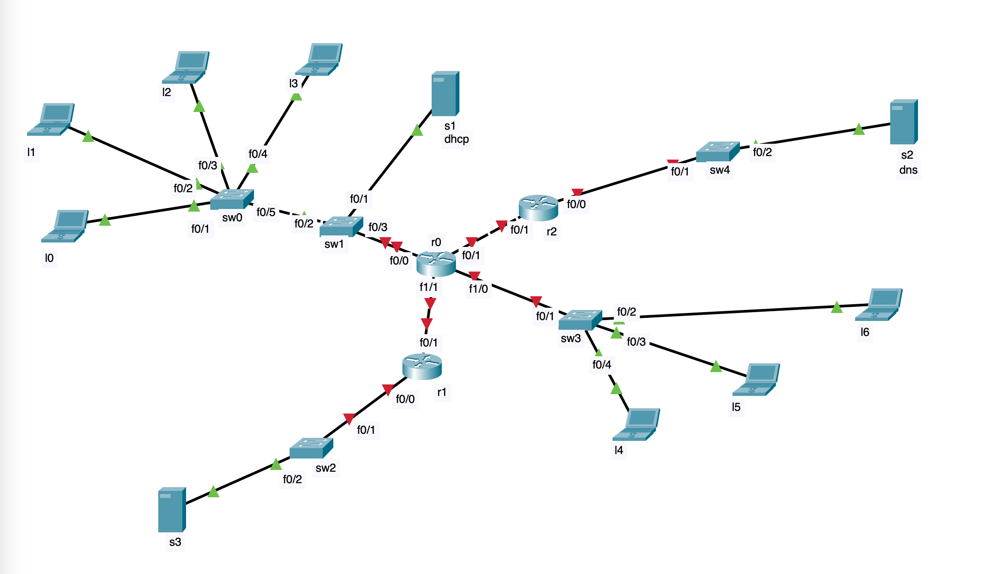

import InteractiveTableWrapper from '../../../static/lib/openProt'
import {DHCPD, DHCPO, DHCPR, DHCPA, DHCP} from './top1/dhcp'
import {OSPFHello, OSPFDBupdate} from './top1/routing'
import { Eth, IP, ARP, UDP, IPone, UDPone, Line, ARPans, DNS, DNSreply, TCPopen, TCP, TCPclose} from './top1/standart'
import {Table, ARPTable, MACTable} from './top1/tables'
import CollapsibleText from '../../../static/lib/unvisible'

# Билет 0

## Топология

## Конфигурации

<CollapsibleText label = "Конфигурация роутера R0">

<Table data={[
{ "Interface": "Fa0/0", "IP": "1.1", "MAC": "A1" },
{ "Interface": "Fa0/1", "IP": "2.1", "MAC": "A2" },
{ "Interface": "Fa1/0", "IP": "3.1", "MAC": "A3" },
{ "Interface": "Fa1/1", "IP": "4.1", "MAC": "A4" },
]} />
</CollapsibleText>

<CollapsibleText label = "Конфигурация роутера R1">
<Table data={[
{ "Interface": "Fa0/0", "IP": "5.1", "MAC": "B1" },
{ "Interface": "Fa0/1", "IP": "4.2", "MAC": "B2" },
]} />
</CollapsibleText>

<CollapsibleText label = "Конфигурация роутера R2">
<Table data={[
{ "Interface": "Fa0/0", "IP": "6.1", "MAC": "C1" },
{ "Interface": "Fa0/1", "IP": "2.2", "MAC": "C2" },
]} />
</CollapsibleText>

<CollapsibleText label = "Конфигурации компов">
<Table data={[
{ "Comp": "l0", "IP": "DHCP(1.3)", "MAC": "D1" },
{ "Comp": "l1", "IP": "DHCP(1.4)", "MAC": "D2" },
{ "Comp": "l2", "IP": "DHCP(1.5)", "MAC": "D3" },
{ "Comp": "l3", "IP": "DHCP(1.6)", "MAC": "D4" },
{ "Comp": "l4", "IP": "3.2",       "MAC": "D5" },
{ "Comp": "l5", "IP": "3.3",       "MAC": "D6" },
{ "Comp": "l6", "IP": "3.4",       "MAC": "D7" },
{ "Comp": "s1", "IP": "1.2",       "MAC": "D8" },
{ "Comp": "s2", "IP": "6.2",       "MAC": "D9" },
{ "Comp": "s3", "IP": "2.2",       "MAC": "D10"},
]} />
</CollapsibleText>

<CollapsibleText label = "Конфигурация DHCP">
<Table data={[
{ "Pref": "Пул адресов", "Value": "1.0/24" },
{ "Pref": "Резерв", "Value": "1.1" },
{ "Pref": "Default gateway", "Value": "1.1" },
{ "Pref": "DNS", "Value": "6.2" },
]} />
</CollapsibleText>

<CollapsibleText label = "Конфигурация DNS">
<Table data={[
{ "Name": "bmstu.ru", "Type": "A", "IP": "2.2" },
]} />
</CollapsibleText>

## Маршрутизация: OSPF

Маршрутизация происходит по протоколу OSPF все компы находятся в area 0. Таблицы маршрутизации ниже показывают сеть, которая полностью сошлась.

<CollapsibleText label = "Пакеты OSPF">
#### Пакеты с R0
Тогда вот все Hello пакеты, которые роутер будет рассылать (тут ip и mac multicast-адреса для данного протокола):
<Line/>
<OSPFHello  sourEth={'A1'} sourIp={'1.1'}/>
<Line/>
<OSPFHello  sourEth={'A2'} sourIp={'2.1'}/>
<Line/>
<OSPFHello  sourEth={'A3'} sourIp={'3.1'}/>
<Line/>
<OSPFHello  sourEth={'A4'} sourIp={'4.1'}/>
<Line/>

Так же, помимо Hello-пакетов роутер будет рассылать пакеты с обновлениями по соседним роутерам. Роутер узнает об их существовании тоже по Hello рассылке, поэтому рассылка обновлений происходит по unicast с указанием определенных ip и mac адресов соседей (их роутер узнает из Hello пакетов).

<Line/>
<OSPFDBupdate destEth={'C2'} sourEth={'A2'} sourIp={'2.1'} destIP={'2.2'}/>
<Line/>
<OSPFDBupdate destEth={'B2'} sourEth={'A4'} sourIp={'4.1'} destIP={'4.2'}/>
<Line/>

#### Пакеты с R1

<Line/>
<OSPFHello  sourEth={'B1'} sourIp={'5.1'}/>
<Line/>
<OSPFHello  sourEth={'B2'} sourIp={'4.2'}/>
<Line/>
<OSPFDBupdate destEth={'A4'} sourEth={'B2'} sourIp={'4.2'} destIP={'4.1'}/>
<Line/>
#### Пакеты с R2
<Line/>
<OSPFHello  sourEth={'C1'} sourIp={'6.1'}/>
<Line/>
<OSPFHello  sourEth={'C2'} sourIp={'2.2'}/>
<Line/>
<OSPFDBupdate destEth={'A2'} sourEth={'C2'} sourIp={'2.2'} destIP={'2.1'}/>
<Line/>
</CollapsibleText>

<CollapsibleText label = "Таблица маршрутизации роутера R0">
<Table data={[
{ "Net": "1.0", "Connect": "DC",              "Interface": "F0/0" },
{ "Net": "2.0", "Connect": "DC",              "Interface": "F0/1" },
{ "Net": "3.0", "Connect": "DC",              "Interface": "F1/0" },
{ "Net": "4.0", "Connect": "DC",              "Interface": "F1/1" },
{ "Net": "5.0", "Connect": "[110/2] via 4.2", "Interface": "F0/1" },
{ "Net": "6.0", "Connect": "[110/2] via 2.2", "Interface": "F1/1" },
]} />
</CollapsibleText>

<CollapsibleText label = "Таблица маршрутизации роутера R1">
<Table data={[
{ "Net": "2.0", "Connect": "DC",              "Interface": "F0/1" },
{ "Net": "6.0", "Connect": "DC",              "Interface": "F0/0" },
{ "Net": "1.0", "Connect": "[110/2] via 2.1", "Interface": "F0/1" },
{ "Net": "3.0", "Connect": "[110/2] via 2.1", "Interface": "F0/1" },
{ "Net": "4.0", "Connect": "[110/2] via 2.1", "Interface": "F0/1" },
{ "Net": "5.0", "Connect": "[110/3] via 2.1", "Interface": "F0/1" },
]} />
</CollapsibleText>

<CollapsibleText label = "Таблица маршрутизации роутера R2">
<Table data={[
{ "Net": "4.0", "Connect": "DC",              "Interface": "F0/1" },
{ "Net": "5.0", "Connect": "DC",              "Interface": "F0/0" },
{ "Net": "1.0", "Connect": "[110/2] via 4.1", "Interface": "F0/1" },
{ "Net": "2.0", "Connect": "[110/2] via 4.1", "Interface": "F0/1" },
{ "Net": "3.0", "Connect": "[110/2] via 4.1", "Interface": "F0/1" },
{ "Net": "6.0", "Connect": "[110/3] via 4.1", "Interface": "F0/1" },
]} />
</CollapsibleText>

<CollapsibleText label = "ARP таблицы устройств после прохождения OSPF пакетов">
<ARPTable data={
{
    r0: {'2.2': 'C2', '4.2': 'B2'},
    r1: {'4.1': 'A4'},
    r2: {'2.1': 'A2'},
    l0: {' ':''},
    l1: {' ':''},
    l2: {' ':''},
    l3: {' ':''},
    l4: {' ':''},
    l5: {' ':''},
    l6: {' ':''},
    s1: {' ':''},
    s2: {' ':''},
    s3: {' ':''},
}
}/>
</CollapsibleText>

<CollapsibleText label = "MAC таблицы устройств после прохождения OSPF пакетов">
<MACTable data={
{
    sw0:{'fa0/5':'A1'},
    sw1:{'fa0/3':'A1'},
    sw2:{'fa0/1':'B1'},
    sw3:{'fa0/1':'A3'},
    sw4:{'fa0/1':'C1'}
}
}/>
</CollapsibleText>

## Получение DHCP компами

Компы l0, l1, l2, l3 получают ip по протоколу DHCP. Опишем процесс получения ip. У первого компа распишем подробнее.

<CollapsibleText label = "DHCP получение IP первым компом">
<Line/>
Сначала компьютер рассылает Discover чтоб найти DHCP сервер
<DHCPD from={'D1'}/>
<Line/>
Сервер получает Discover и ищет свободный адрес в пуле. Чтоб не получилось так, что пользователь уже назначил ip где-то в сети сам сервер посылает ARP запрос, чтоб проверить нет ли никакого компа с таким ip.
<ARP sourEth={'D8'} sour={'1.2'} dest={'1.3'}/>
<Line/>
После того как на ARP никто не ответил сервер убеждается в том, что ip свободен, а значит его может занять наш компьютер. Для этого сервер отправляет широковещательно предложение компу.
<DHCPO from={'D8'} fromIP={'1.2'}/>
<Line/>
Комп принимает предложение и высылает запрос серверу. Это сделано так как в сети может быть много DHCP серверов и если сервер выделит IP, а комп выберет другой, то сервер не будет знать про это и его пул будет меньше ожидаемого.
<DHCPR from={'D1'}/>
<Line/>
Сервер посылает подтверждение занятия данного адреса компом. Теперь сервер не будет выдавать этот ip (до того как пул закончится, если он закончится, то сервер проверит arp запросом отключился ли комп и если да, то он снова выдаст этот же ip).
<DHCPA from={'D8'} fromIP={'1.2'}/>
<Line/>
Комп когда ему выдали ip сам проверяет нет ли никакого компа в сети с таким же IP так как все операции не атомарны. Заодно комп рассылает свой MAC для заполнения ARP таблиц.
<ARP sourEth={'D1'} sour={'1.3'} dest={'1.3'}/>
<Line/>
</CollapsibleText>

<CollapsibleText label = "DHCP получение IP вторым компом">
    <DHCP from='D2' to='D8' toIP='1.2' giveIP='1.4'/>
</CollapsibleText>

<CollapsibleText label = "DHCP получение IP третьим компом">
    <DHCP from='D3' to='D8' toIP='1.2' giveIP='1.5'/>
</CollapsibleText>

<CollapsibleText label = "DHCP получение IP четвертым компом">
    <DHCP from='D4' to='D8' toIP='1.2' giveIP='1.6'/>
</CollapsibleText>

<CollapsibleText label = "ARP таблицы устройств после прохождения DHCP пакетов">
<ARPTable data={
{
    r0: {'2.2': 'C2', '4.2': 'B2', '1.2': 'D8', '1.3': 'D1', '1.4': 'D2', '1.5': 'D3','1.6': 'D4'},
    r1: {'4.1': 'A4'},
    r2: {'2.1': 'A2'},
    l0: {'1.2': 'D8', '1.4': 'D2', '1.5': 'D3', '1.6': 'D4'},
    l1: {'1.2': 'D8', '1.3': 'D1', '1.5': 'D3', '1.6': 'D4'},
    l2: {'1.2': 'D8', '1.3': 'D1', '1.4': 'D2', '1.6': 'D4'},
    l3: {'1.2': 'D8', '1.3': 'D1', '1.4': 'D2', '1.6': 'D4'},
    l4: {' ':''},
    l5: {' ':''},
    l6: {' ':''},
    s1: {'1.3': 'D1', '1.4': 'D2', '1.5': 'D3', '1.6': 'D4'},
    s2: {' ':''},
    s3: {' ':''},
}
}/>
</CollapsibleText>
<CollapsibleText label = "MAC таблицы устройств после прохождения DHCP пакетов">
<MACTable data={
{
    sw0:{'fa0/1':'D1', 'fa0/2':'D2', 'fa0/3':'D3', 'fa0/4':'D4', 'fa0/5':'D8'},
    sw1:{'fa0/1':'D8', 'fa0/2':'D4', 'fa0/3':'A1'},
    sw2:{'fa0/1':'B1'},
    sw3:{'fa0/1':'A3'},
    sw4:{'fa0/1':'C1'}
}
}/>
</CollapsibleText>

## L2 отправляет запрос на получение почты с сервера bmstu.ru

Клиент отправляет серверу запрос на получение почты, значит работает протокол POP3. Перед открытием TCP соединения найдем bmstu.ru, обратившись к DNS серверу.

<CollapsibleText label = "Общаемся с DNS">
    Нужно послать запрос в сеть 6.0/24 она отличается от сети компа 1.0/24, поэтому на уровне L2 комп поставит адрес dg, т.е. адрес роутера. IP dg установил DHCP - он прислал его в offer компу. Создадим ARP запрос, чтоб найти MAC адрес роутера.
    <Line/>
    <ARP sourEth={'D3'} sour={'1.5'} dest={'1.1'}/>
    <Line/>
    <ARPans destEth={'D3'} sourEth={'A1'} sour={'1.1'}/>
    <Line/>
    В ответе содержится MAC роутера. Комп заполняет ARP-таблицу и готовит DNS:
    <Line/>
    <DNS
        destEth='A1' sourEth='D3'
        sourIp={'1.5'} destIp={'6.2'}
        sour='1025' domain='bmstu.ru'
    />
    <Line/>
    <DNS
        destEth='A2' sourEth='C2'
        sourIp={'1.5'} destIp={'6.2'}
        sour='1025' domain='bmstu.ru'
    />
    <Line/>
    Тут пакет будет уничтожен, так как ARP таблица роутера не заполнена.
    <Line/>
    <ARP sourEth={'C1'} sour={'6.1'} dest={'6.2'}/>
    <Line/>
    <ARPans destEth={'C1'} sourEth={'D9'} sour={'6.2'}/>
    <Line/>
    Теперь ARP заполнена. Кинем пакет еще раз:
    <Line/>
    <DNS
        destEth='A1' sourEth='D3'
        sourIp={'1.5'} destIp={'6.2'}
        sour='1025' domain='bmstu.ru'
    />
    <Line/>
    <DNS
        destEth='A2' sourEth='C2'
        sourIp={'1.5'} destIp={'6.2'}
        sour='1025' domain='bmstu.ru'
    />
    <Line/>
    <DNS
        destEth='C1' sourEth='D9'
        sourIp={'1.5'} destIp={'6.2'}
        sour='1025' domain='bmstu.ru'
    />
    <Line/>
    <DNSreply
        destEth='D9' sourEth='C1'
        sourIp={'6.2'} destIp={'1.5'}
        dest='1025' domain='bmstu.ru' domainIP='2.2'
    />
    <Line/>
    <DNSreply
        destEth='C2' sourEth='A2'
        sourIp={'6.2'} destIp={'1.5'}
        dest='1025' domain='bmstu.ru' domainIP='2.2'
    />
    <Line/>
    <DNSreply
        destEth='A1' sourEth='D3'
        sourIp={'6.2'} destIp={'1.5'}
        dest='1025' domain='bmstu.ru' domainIP='2.2'
    />
    <Line/>
    Пакет дошел. Теперь комп знает ip сервера bmstu.ru.
</CollapsibleText>

<CollapsibleText label = "Открытие TCP соединения">
    Для открытия соединения используем 3 рукопожатия.
    <Line/>
    <TCP flag={'SYN'} destEth={'A1'} sourEth={'D3'} sourIp={'1.5'} destIp={'2.2'} sour={'1026'} dest={'110'} />
    <Line/>
    <TCP flag={'SYN'} destEth={'B2'} sourEth={'A4'} sourIp={'1.5'} destIp={'2.2'} sour={'1026'} dest={'110'} />
    <Line/>
    Тут пакет опять умрет из-за того, что ARP не заполнена.
    <Line/>
    <ARP sourEth={'B1'} sour={'2.1'} dest={'2.2'}/>
    <Line/>
    <ARPans destEth={'B1'} sourEth={'D10'} sour={'2.2'}/>
    <Line/>
    Теперь таблица заполнена. Пошлем пакет еще раз.
    <TCPopen destEth={['A1', 'B2', 'D10']} sourEth={['D3', 'A4', 'B1']} sourIp='1.5' destIp='2.2' sour='1026' dest='110'/>
    Теперь мы открыли TCP соединение.
</CollapsibleText>

<CollapsibleText label = "Отправка запроса POP3">
    Теперь, когда соединение открыто, создаем запрос с аутентификацией на почтовый сервер.
    <Line/>
    <TCP flag={''} destEth={'A1'} sourEth={'D3'} sourIp={'1.5'} destIp={'2.2'} sour={'1026'} dest={'110'} >
        <InteractiveTableWrapper cellsData={{ 'POP3 Request': '' }} label="POP3"/>
    </TCP>
    <Line/>
    <TCP flag={''} destEth={'B2'} sourEth={'A4'} sourIp={'1.5'} destIp={'2.2'} sour={'1026'} dest={'110'} >
        <InteractiveTableWrapper cellsData={{ 'POP3 Request': '' }} label="POP3"/>
    </TCP>
    <Line/>
    <TCP flag={''} destEth={'D10'} sourEth={'B1'} sourIp={'1.5'} destIp={'2.2'} sour={'1026'} dest={'110'} >
        <InteractiveTableWrapper cellsData={{ 'POP3 Request': '' }} label="POP3"/>
    </TCP>
    <Line/>
    <TCP flag={'ACK+PSH'} destEth={'D10'} sourEth={'B1'} sourIp={'2.2'} destIp={'1.5'} sour={'110'} dest={'1026'} >
        <InteractiveTableWrapper cellsData={{ 'POP3 Answer': '' }} label="POP3"/>
    </TCP>
    <Line/>
    <TCP flag={'ACK+PSH'} destEth={'A4'} sourEth={'B2'} sourIp={'2.2'} destIp={'1.5'} sour={'110'} dest={'1026'} >
        <InteractiveTableWrapper cellsData={{ 'POP3 Answer': '' }} label="POP3"/>
    </TCP>
    <Line/>
    <TCP flag={'ACK+PSH'} destEth={'D3'} sourEth={'A1'} sourIp={'2.2'} destIp={'1.5'} sour={'110'} dest={'1026'} >
        <InteractiveTableWrapper cellsData={{ 'POP3 Answer': '' }} label="POP3"/>
    </TCP>
    <Line/>
    Пакет прошел и сервер ответил нам обновлением. Теперь можно завершать соединение.
</CollapsibleText>

<CollapsibleText label = "Закрытие TCP соединения">
    <TCPclose destEth={['A1', 'B2', 'D10']} sourEth={['D3', 'A4', 'B1']} sourIp='1.5' destIp='2.2' sour='1026' dest='110'/>
</CollapsibleText>

<CollapsibleText label = "ARP таблицы устройств после выполнения задания">
<ARPTable data={
{
    r0: {'2.2': 'C2', '4.2': 'B2', '1.2': 'D8', '1.3': 'D1', '1.4': 'D2', '1.5': 'D3','1.6': 'D4'},
    r1: {'4.1': 'A4', '1.5': 'A4', '2.2': 'D10'},
    r2: {'2.1': 'A2', '1.5': 'A2', '6.2': 'D9'},
    l0: {'1.2': 'D8', '1.4': 'D2', '1.5': 'D3', '1.6': 'D4'},
    l1: {'1.2': 'D8', '1.3': 'D1', '1.5': 'D3', '1.6': 'D4'},
    l2: {'1.2': 'D8', '1.3': 'D1', '1.4': 'D2', '1.6': 'D4', '1.1': 'A1'},
    l3: {'1.2': 'D8', '1.3': 'D1', '1.4': 'D2', '1.6': 'D4'},
    l4: {' ':''},
    l5: {' ':''},
    l6: {' ':''},
    s1: {'1.3': 'D1', '1.4': 'D2', '1.5': 'D3', '1.6': 'D4'},
    s2: {'6.1':'C1', '1.5': 'C1'},
    s3: {'2.1':'B1', '1.5': 'B1'},
}
}/>
</CollapsibleText>
<CollapsibleText label = "MAC таблицы устройств после выполнения задания">
<MACTable data={
{
    sw0:{'fa0/1':'D1', 'fa0/2':'D2', 'fa0/3':'D3', 'fa0/4':'D4', 'fa0/5':'D8'},
    sw1:{'fa0/1':'D8', 'fa0/2':'D3', 'fa0/3':'A1'},
    sw2:{'fa0/1':'B1', 'fa0/2':'D10'},
    sw3:{'fa0/1':'A3'},
    sw4:{'fa0/1':'C1', 'fa0/2':'D9'}
}
}/>
</CollapsibleText>
